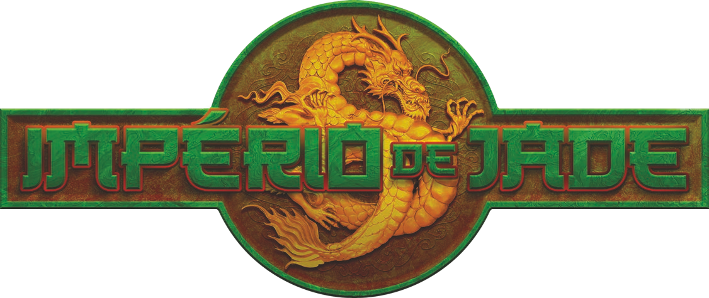

# Gerador de Recompensas para Império de Jade RPG

**Utilize esse website para gerar as recompensas para a sua campanhade RPG baseado apenas no ND, sem precisar rolar dados!**

> [!CAUTION]
> Embora o link para o site no github funcione, a função de gerar os itens reportará o erro ERR_CONNECTION_REFUSED no console.
> Isso se deve ao fato de que para chamar tal função, o site precisa enviar um post request para o servidor, rodando o código
> em python. Uma vez que for configurado o servidor online, será possível gerar suas recompensas sem problemas, e o servidor
> será configurado assim que o dicionário de armas, armaduras e materiais especias estiver pronto.

> [!WARNING]
> Esse website ainda está em desenvolvimento! Mudanças drásticas podem acontecer no layout e/ou funcionalidade do website. Por favor atente-se às notas de versão.

## O que é

O website será dividido em várias partes para que o usuário tenha total liberdade de escolher entre criar recompensas completamente novas, ou criar apenas uma arma, um item mágico, entre outros...

## Como funciona e afazeres

Como mencionado no alerta no início, **esse website ainda está em desenvolvimento**. Não só mudanças drásticas podem acontecer no layout e/ou funcionalidade, como também ainda falta adicionar vários recursos cruciais.

- Para a criação de recompensas completamente novas, basta usar a primeira ferramenta através do `seletor de ND` e tudo será gerado de forma completamente nova.
- Para a criação de recompensas específicas, basta utilizar a ferramenta específica **(por favor consultar as notas de atualização e lista de afazeres abaixo para quais recompensas específicas já estão disponíveis)**.

> [!WARNING]
> Essa lista de tarefas está sujeito a mudanças, com novas tarefas podendo ser adicionadas e/ou já existentes sendo removidas.

- [x] Criação do layout básico do website.
- [x] Funcionalidade de gerar quais serão as recompensas.
- [x] Alteração no DOM para que as recompensas e tesouros sejam exibidos no website, ao lado ou abaixo do `seletor de ND`, dependendo do tamanho da tela.
- [x] Criação do dicionário de gemas.
- [x] Criação do dicionário de obras de arte.
- [x] Criação do dicionário de itens diversos.
- [ ] Criação do dicionário de armas.
- [ ] Criação do dicionário de armaduras.
- [ ] Criação do dicionário de materiais especiais.
- [ ] Criação do dicionário de itens mágicos.
- [ ] Criação do dicionário de armas específicas.
- [ ] Criação do dicionário de armaduras específicas.
- [ ] Criação do dicionário de ofuda.
- [ ] Criação do dicionário de amuletos.
- [ ] Criação do dicionário de acessórios.
- [ ] \(Opcional) Criar uma plataforma para login do usuário para armazenar e acessar o histórico de recompenas criadas.

## Rodapé

**Criado por _Andrew Canto Oliveira_.**
